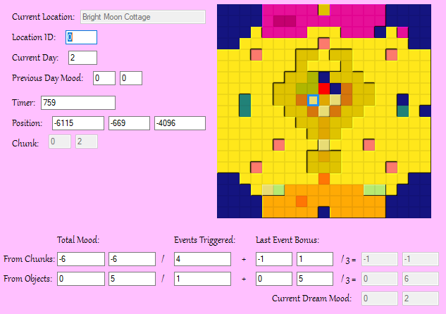

A fork of Lucid Dream Explorer with a focus on providing an accurate real-time "prediction" on the position of the dream in the Dream Chart.
Lucid-Dream-Explorer is a tool designed for exploration of the PS1 game LSD: Dream Emulator. Built by Fhoughton using code from Muscle Trainer by ConfuseMe.
This program is tested to work on psxfin 1.13 and NO$PSX 2.2.

## Usage:
- Grab the latest build from the [releases page](/../../releases).
- Ideally, start up the emulator and game up until the main menu appears *before* you run the program.
- Run the program, if everything went well, the values should begin updating and you should see a flashing red square in the chart.
- To edit a value select it and then type a new value and press enter to write it back into memory.

## New Features:
- The flashing red square in the dream chart provides an accurate real-time representation of the current dream rating, as it would appear in the graph screen should the dream end there. It is theorised that the location of this point affects the appearance of rare events.
- The hollow blue square in the chart, on the other hand, shows the Mood Value assocciated with the [map chunk](https://docs.lsdrevamped.net/lsd-de-research/static-analysis/file-formats#lbd) you're currently standing on. Barring some execeptions, every walkable chunk in the game has it's own position on the dream chart.
- Previous Day Mood shows the final mood rating of the dream you last played. For any day besides the first, you can change this value to force the game to spawn you on a different location on your next dream.
- Position: Chunk shows the position coordinates of the chunk you're currently at (not to be confused with the dream graph coordinates). For non-tower maps, Higher values are further East and further North respectively.
- The values below the dream chart are multiple variables used to calculate the dream rating, you can change them individually to affect the final chart rating in various ways.
