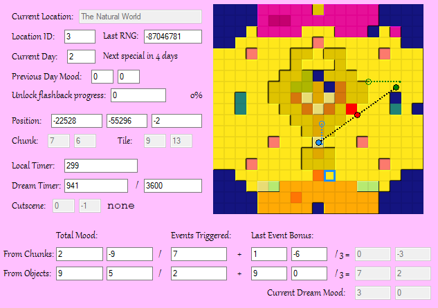

A fork of Lucid Dream Explorer with a focus on providing an accurate real-time "prediction" on the position of the dream in the Dream Chart.

Lucid-Dream-Explorer is a tool designed for exploration of the PS1 game LSD: Dream Emulator. Built by Fhoughton using code from Muscle Trainer by ConfuseMe.

This program is tested to work on psxfin 1.13 and NO$PSX 2.2.

## Usage:
- Grab the latest build from the [releases page](/../../releases).
- Ideally, start up the emulator and game up until the main menu appears *before* you run the program.
- Run the program, if everything went well, the values should begin updating and you should see a flashing red square in the chart.
- To edit a value select it and then type a new value and press enter to write it back into memory.

## New Features:
- The dream chart graph provides visuals on various parts of the Dream Rating calculation, for more information on how the Dream Rating is calculated you can check the [Osamu Sato Wiki article about it](https://compu-lsd.com/w/Graph#Graph_formula).
  - The flashing red square with the red dot on it provides an accurate real-time representation of the current dream rating, as it would appear in the graph screen should the dream end there. It is theorised that the location of this point affects the appearance of rare events.
  - The hollow blue square in the chart, on the other hand, shows the Mood Value assocciated with the [map chunk](https://docs.lsdrevamped.net/lsd-de-research/static-analysis/file-formats#lbd) you're currently standing on. Barring some execeptions, every walkable chunk in the game has it's own position on the dream chart.
  - Once you visited more than one map chunk, the small blue ring shows the raw average point between all chunks visited, while the dotted blue line extending out of it shows the displacement caused by the "recency bonus" of the current Mood Value.
  - If you have interacted with at least one entity this dream, the green ring and line will show the average point for the entities part of the formula. While the blue and green outlined dots show the final, truncated results for the Area Point and Entity Point respectively. from the mid-point of these two result points the red Final Rating point is drawn.

- The "Last RNG" box shows the value currently stored on the game's [Pseudorandom number generator](https://en.wikipedia.org/wiki/Pseudorandom_number_generator), mostly intended to show how often and for what reasons that number changes, but you could in theory write your own numbers in there to affect the outcome of randomness in the game. 
- The "Previous Day Mood" box shows the final mood rating of the dream you last played. For any day besides the first, you can change this value to force the game to spawn you on a different location on your next dream.
- The "Flashback progress" contains the "score" the game keeps track of to decide if you have unlocked the flashback mechanic. You need a value of at least 10000000 (Ten Million), on top of a non-empty flashback compilation, in order for the flashback option to show up in the main menu.
- Below the player position boxes, you can now see the chunk and tile associated with that position.
- The Dream Timer shows how long you have been in a dream, according to the game. And also the time limit of the current dream.
- The cutscene box shows the code used by the game to queue up Event/Special Days cinematics, the text next to it is the tool's prediction of what the filename of that cutscene is. 
- The values below the dream chart are the multiple variables used on the dream rating formula, you can change them individually to affect the final chart rating in various ways.